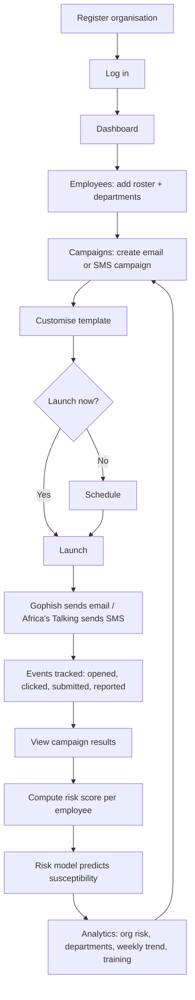
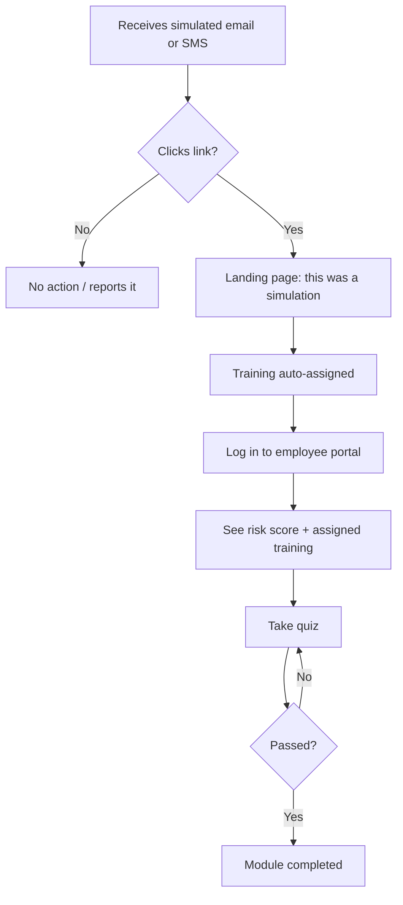

# RedFlag

Simulates phishing/smishing attacks and predicts employee susceptibility with
logistic regression for Kenyan organizations.

## Stack

- Simulation engine: Node/Express, JWT + bcrypt auth, RBAC
- Portal: React — admin + employee portals
- DB: PostgreSQL, 3NF, multi-tenant
- Risk model: Python/scikit-learn logistic regression scoring service
- Integrations: Gophish (email), Africa's Talking (SMS)

## Layout

```
/simulation-engine   Express API (auth, campaigns, scoring, training, analytics)
/portal              React admin + employee portals
/risk-model          Python logistic regression scorer
```

## Flows

### Admin



### Employee



## Run locally

1. Create a `.env` (see `docker-compose.yml` / `simulation-engine/src/config/env.js`)
2. `docker compose up --build`

Ports: Postgres `5432`, simulation-engine `4000`, risk-model `8000`, portal `5173`.

Or run each service on its own: `npm run dev` (simulation-engine/portal) or
`uvicorn app.api:app --reload` (risk-model, Python 3.11, after `pip install -r requirements.txt`).

## ML model

- Docker: trains on first start if `risk-model/models/latest.joblib` is missing
- Manual: `python -m app.generate_sample_data && python -m app.train` (in `risk-model/`)
- Trained on synthetic data until real simulation history exists

## Contributing

See [CONTRIBUTING.md](CONTRIBUTING.md).

## Status

- Auth, org registration, employee roster
- Email (Gophish) and SMS (Africa's Talking) campaigns, scheduling, template customisation
- Susceptibility scoring, adaptive training with quizzes, analytics dashboard

## Known constraints

- Africa's Talking sandbox: no custom sender ID; messages go to the simulator only
- Schema is a single `schema.sql` run on first DB init — no migration tool yet
